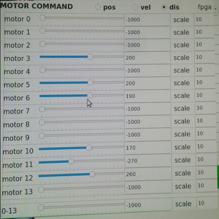
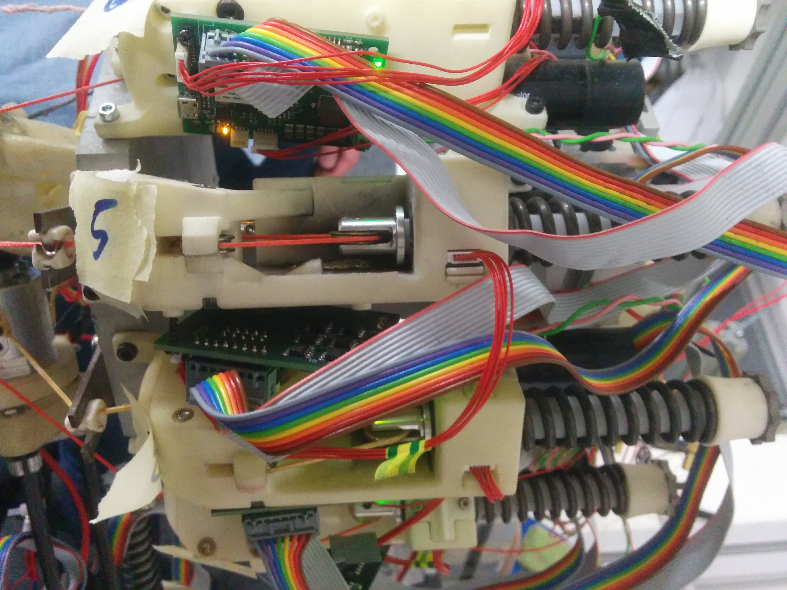
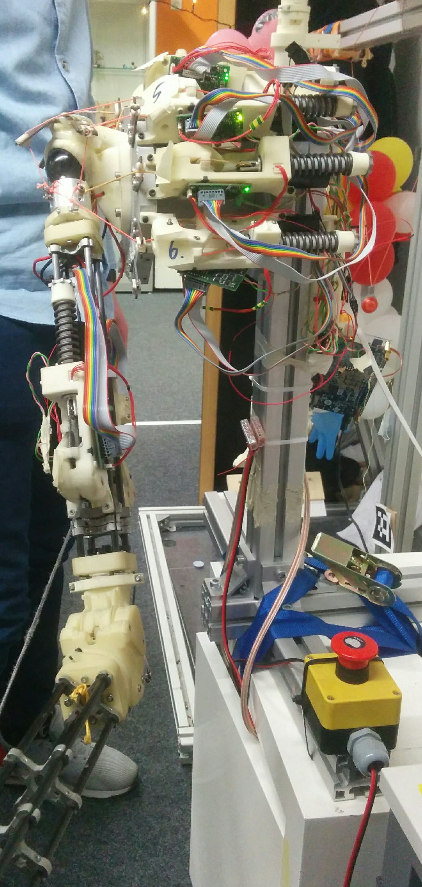
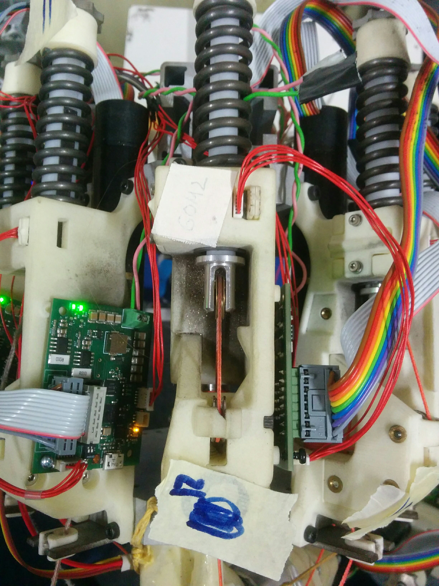
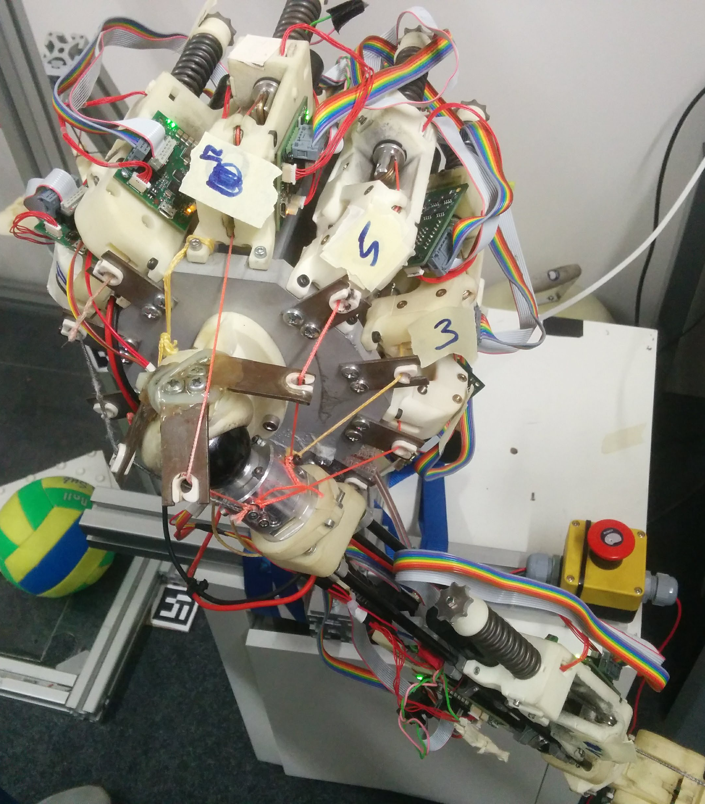

# Machine Learning for System Identification

## Data recording for roboy arm

### Recording Paradigm

We recorded three different poses, depicted below.

"UP"                        |  "SIDE"                     | "ROUND"
:-------------------------: |:-------------------------:  | :-------------------------:
      |     | 


### Recording Setup

#### Settings



#### Software tools

For recording data, first use `rosbag` to record the data from a collection of topics:

```
rosbag record -O recording_file /roboy/middleware/MotorStatus
```

This creates a file `recording_file.bag` which can then be converted into json by calling

```
python convert_bag.py recording_file.bag output_file.json /roboy/middleware/MotorStatus /another/topic
```

To loop over all `.bag` files in a directory, use something like

```
for fp in $(ls *.bag); do python convert_bag.py $fp $fp.json /roboy/middleware/MotorStatus; done
```

## Data loading into numpy

To load the generated files into a numpy array, follow the steps in the notebook `Roboy Data Loading`.


### Additional Images

||
|-|-
|  |  
